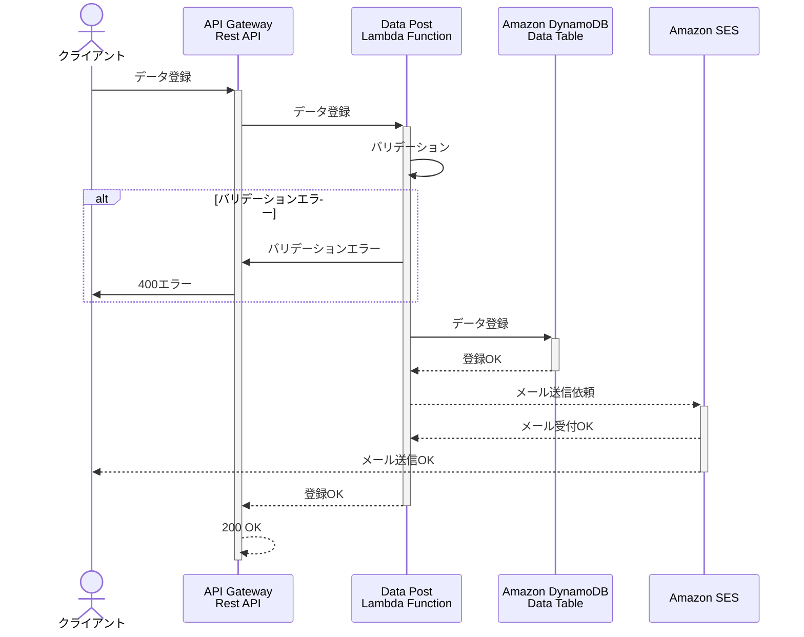

```mermaid
sequenceDiagram
  actor クライアント
  participant API as API Gateway<br/>Rest API
  participant Lambda as Data Post<br/>Lambda Function
  participant DataTable as Amazon DynamoDB<br/>Data Table
  participant SES as Amazon SES

  クライアント ->>+ API: データ登録
  API ->>+ Lambda: データ登録
  Lambda ->> Lambda: バリデーション
  alt バリデーションエラー
    Lambda ->> API: バリデーションエラー
    API ->> クライアント: 400エラー
  end
  Lambda ->>+ DataTable: データ登録
  DataTable -->>- Lambda: 登録OK
  Lambda -->>+ SES: メール送信依頼
  SES -->> Lambda: メール受付OK
  SES -->>- クライアント: メール送信OK
  Lambda -->>-  API: 登録OK
  API -->>- API: 200 OK
```